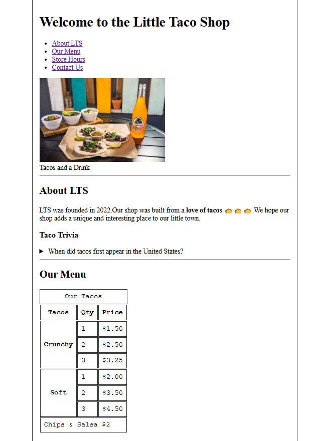
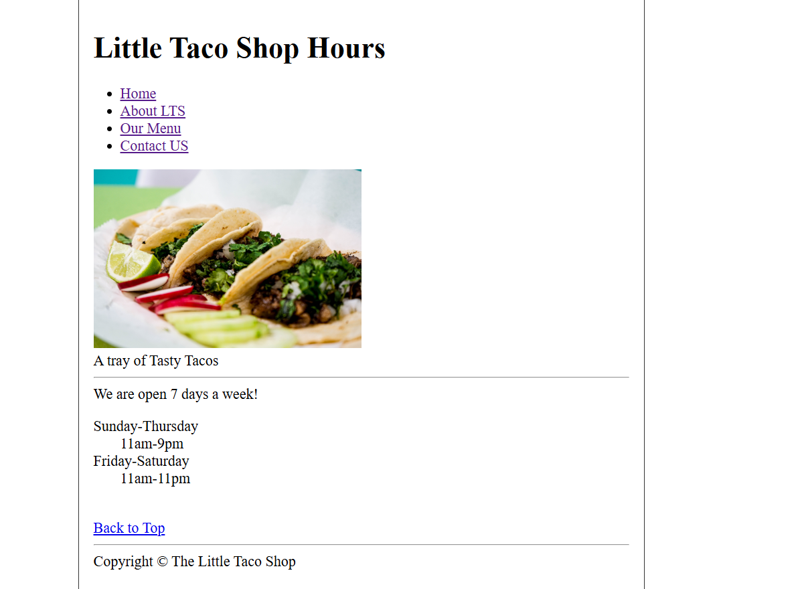
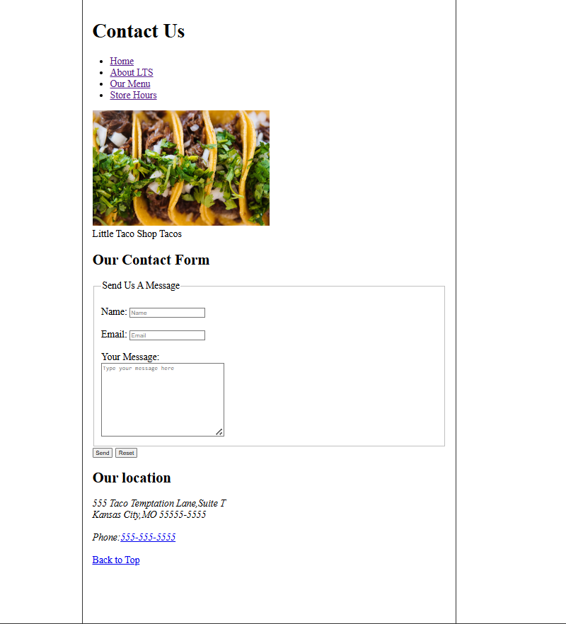
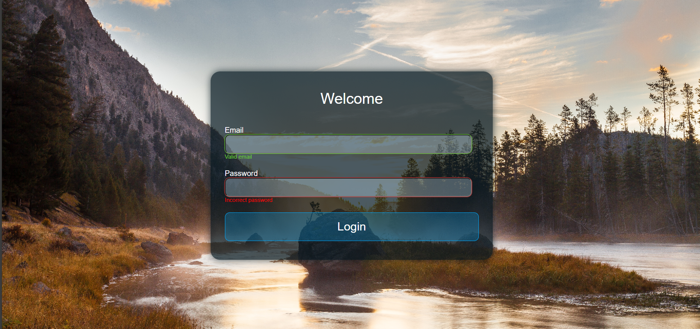
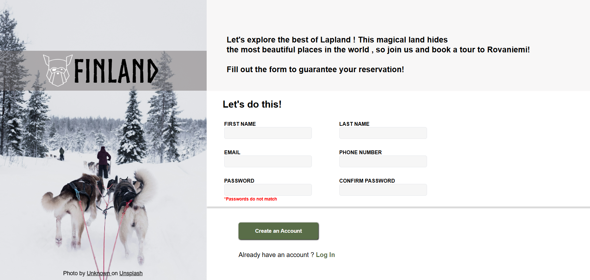

# Front-End-Projects
This repository contains various front end projects that I have built while learning HTML, CSS, JavaScript, and other front end technologies. The following images represents those projects that have been developed. By accessing each folder in this repository you can see the source code !

# Tacos Website Pure HTML

---

<!--
---

--- -->

# Transparent Login Form using CSS

---
# Finnish Form

